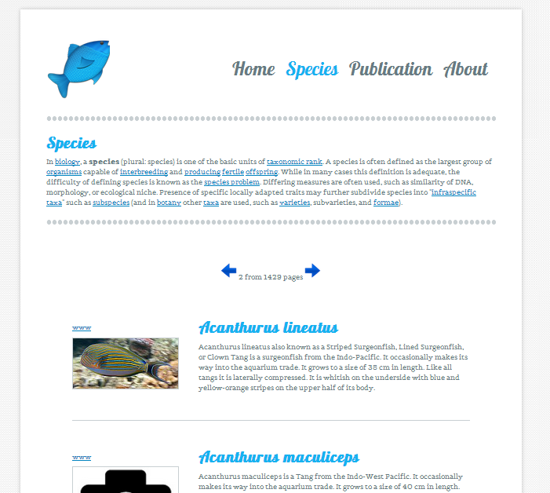
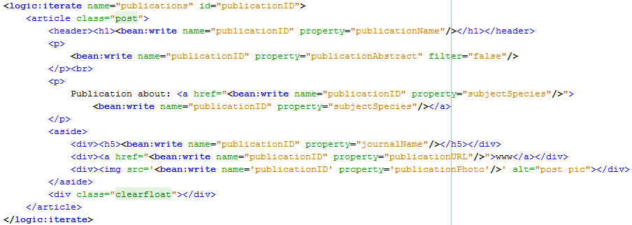
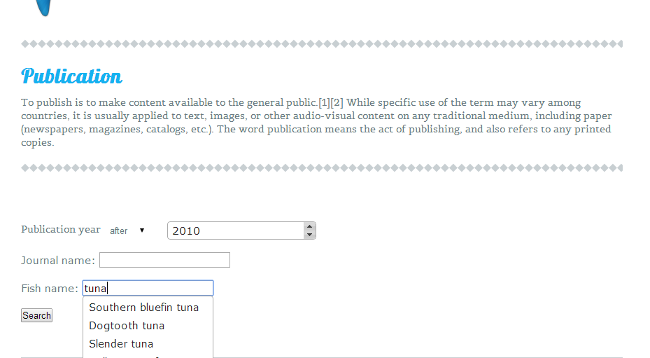
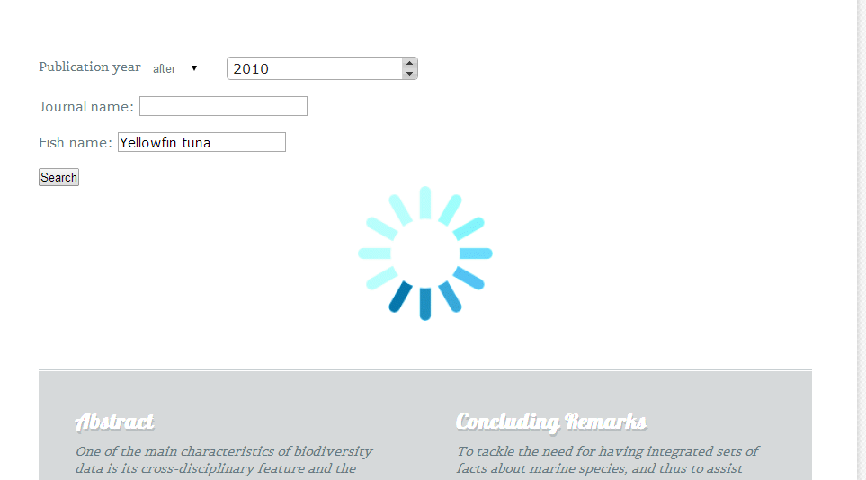
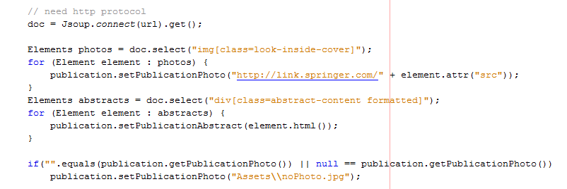
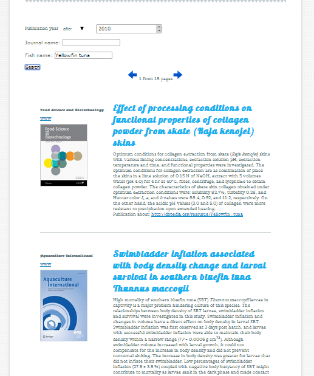

SemanticApp
===========

Project for Semantic Web course

### APPLICATION DESCRIPTION
I have written web application in Java Struts framework. I decided to choose this technology because I needed using Jena library which is wrote in Java. The main features of my application is catalog of all stored fish species and searching publication about some species with some specific attribute.

*Figure 9 Species list*

Figure 9 presented page with species list. Application download also pictures of current fish from dbpedia, and short abstract. To not stress the server to much I am using LIMIT 10, and divide result for separate pages. Below I have presented SPARQL query to downloading fishes from virtuoso:
`select distinct ?a where{?a a <http://www.w3.org/2002/07/owl#Thing>}`
is the very simple query, but when I receive result which is URI address, I am parsing this html website to extract link to photo and abstract. To do it I am using JSOUP library for Java. Jsoup is a Java library for working with real-world HTML. It provides a very convenient API for extracting and manipulating data, using the best of DOM, CSS, and jquery-like methods.
Using features of java struts I didn’t have to create section for each fish. I putted returned fish detail into Vector, and using tag in JSP page (code presented below) I generated result page.
The next features of my application is dynamic publication finding. Its dynamic because it using AJAX and autocomplete features. On the figure 10 I presented autocomplete features. When the user starting type fish name for example, application showing him possible fish name. 

*Figure 10 Publication searcher*

User can find publication with publication year before or after some year, user can also input journal name or fish name. When the field is empty application find publication without any condition. 

*Figure 11 Present result using AJAX*

On the figure 12 is presented publication result for fish species Yellowfin tuna which is published after 2010 year. In this case I also used jsoup library to take photo from other site, regarding with journal cover. Below I presented part of code with jsoup function.

*Figure 12 Publication result*

During the evaluation I didn’t find more bug, I had a problem with pagination but I fixed it. I think the application has modern and nice layout. Application met with requirement. Because I used web framework I decided to not describe all mechanism in java struts, it’s a subject for thesis at least.
